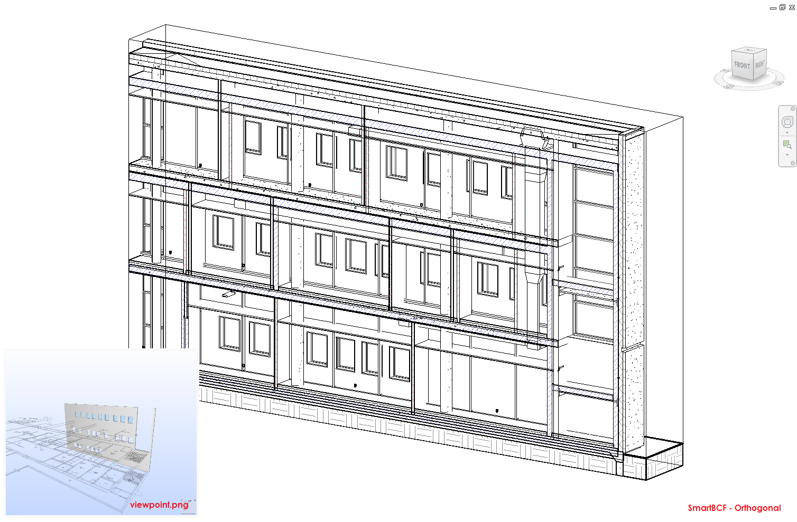
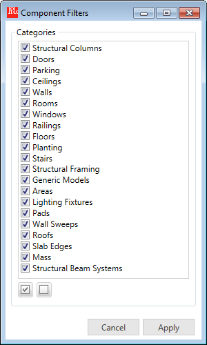

# SmartBCF Add-In for Revit
The SmartBCF Add-In is another component of the tool set including more advanced features that dynamically interacts with elements and 3D views in Revit. This page will focus on Components command. For information of other features, see the [SmartBCF Manager](smartbcf_manager.md) page.

## 1. Navigating Revit Elements

If you want to find the components of the selected topic, press Components button on the tool bar. The tool will open a 3D view among two default views below with the corresponding view settings.

* **SmartBCF - Orthogonal**: if components exist in the current Revit project, a boundingbox that embraces all the components matched will be created for the Section Box.
* **SmartBCF - Perspective**: if no component can be found from the Revit project and if PerspectiveCamera is defined, the background view will be updated as a camera view with the viewpoint settings.

In order to explore each individual element, move next or previous elements by arrow buttons on the top.  The BCF information will be displayed with the selected topic info and options for Comment, Action and Responsibility items.

If you want to take a close look at an element, you may find View Options useful. Select one or multiple  options to find an element making it distinguishable. You may move elements remaining the options selected.

## 2. BCF Shared Parameters
Click "Write Parameters" button in the bottom right to populate BCF information as shared parameters. At the event, following parameters will be generated with the corresponding values.

## 3. Category Filters
If the number of components under a specific topic item is too large so it's hard to find an element, you can filter out components by their categories. 

Click Apply Filters button in the bottom left corner, and select only a few categories needed.

