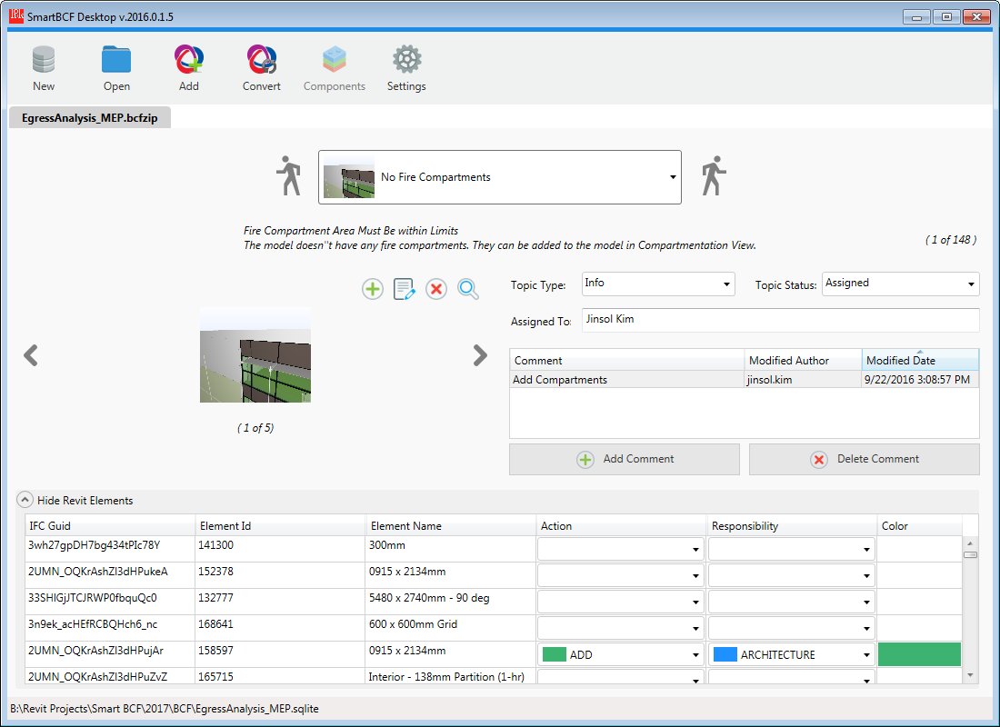
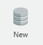
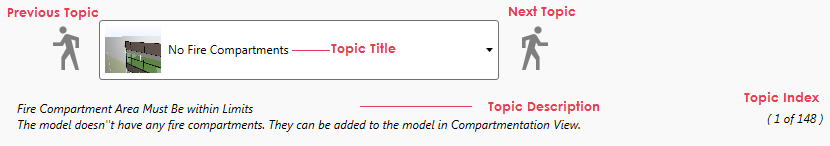
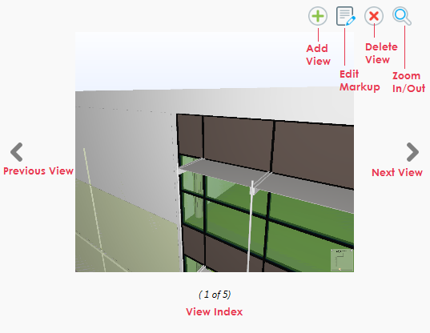
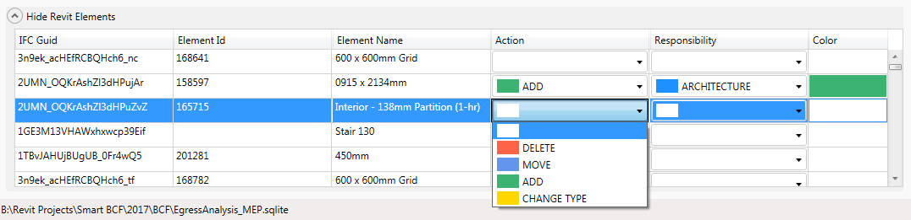
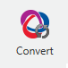
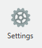
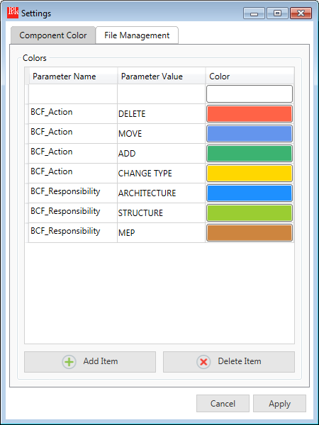

# SmartBCF Manager
The SmartBCF Manager was built as a desktop application for non-Revit users. All features will function same as the SmartBCF AddIn except disabled Components command.

## 1. Creating Database

In order to create SQLite database from BCF, click "New" button and select a bcf file in open file dialog and consecutively specify a file path for SQLite to be saved.

If the SQLite file has been successfully created, you will be able to see the BCF information loaded in the main window like above.

## 2. Selecting Topics

Select a topic from the drop down list or click right/left walker buttons to move to next or previous topics. While the selection changes, all the other UI components for viewpoints, comments, and components will be updated accordingly.

Select a Topic Type and a Topic Status. Available options are followings.
* Topic Type - Error, Info, Unknown, Warning, Issue, Fault, Clash, Request, Inquiry, Remark, Undefined
* Topic Status - Acitve, Assigned, Closed, Open, Resolved

## 3. Editing Viewpoints and Comments

Once a topic is chosen, viewpoints related to the selected topic will be loaded. Navigate views through side buttons and add comments onto the selected view.

## 4. Assigning Action and Responsibility

Pull down the expandable bar named Show Revit Elements, and assign Action and Responsibility items to each component. Color value will be defined by the selection of Action.
For more information about editing color schemes, see section [7. Settings](#7-settings)

## 5. Adding Multiple BCF Files

If you want to add multiple BCF Files into a single database file, click Add button and select a BCF file. 

By default, first loaded BCF will play a role in primary file to apply color schemes to other BCF. You may modify the primary file from Settings command. See section [7. Settings](#7-settings)

## 6. Converting Back to BCF

Whenever you need BCF file to communicate with other software, you can convert the current SQLite file back to BCF through Convert command. 

During the conversion process, all the SmartBCF-specific data will be stored in BCF as an extension file.
* extension.color (in the root folder) - User-defined color schemes for Action and Responsibility.
* viewpoint.bcfvx (in each topic folder) - Element info and assigned parameter values.

## 7. Settings

If you want to modify Color Schemes already loaded in the database, select Component Color tab and start adding new items, specifying a different color or deleting items. 

In order to select a primary file when multiple BCF loaded, go to the File Management tab. 

