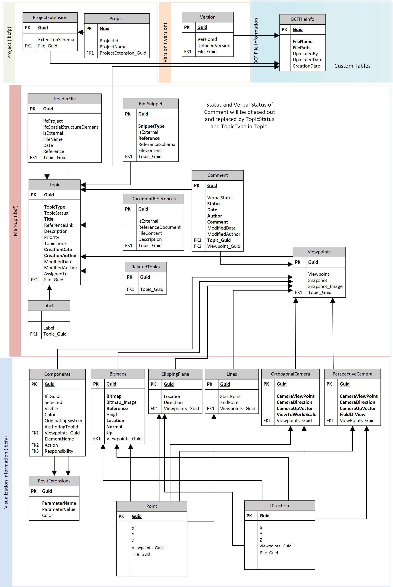

# SmartBCF Schema
This includes a few tool-specific tables (e.g.BCFFileInfo, RevitExtensions). For further information about the schema, visit Github [BCF-XML](https://github.com/BuildingSMART/BCF-XML)

